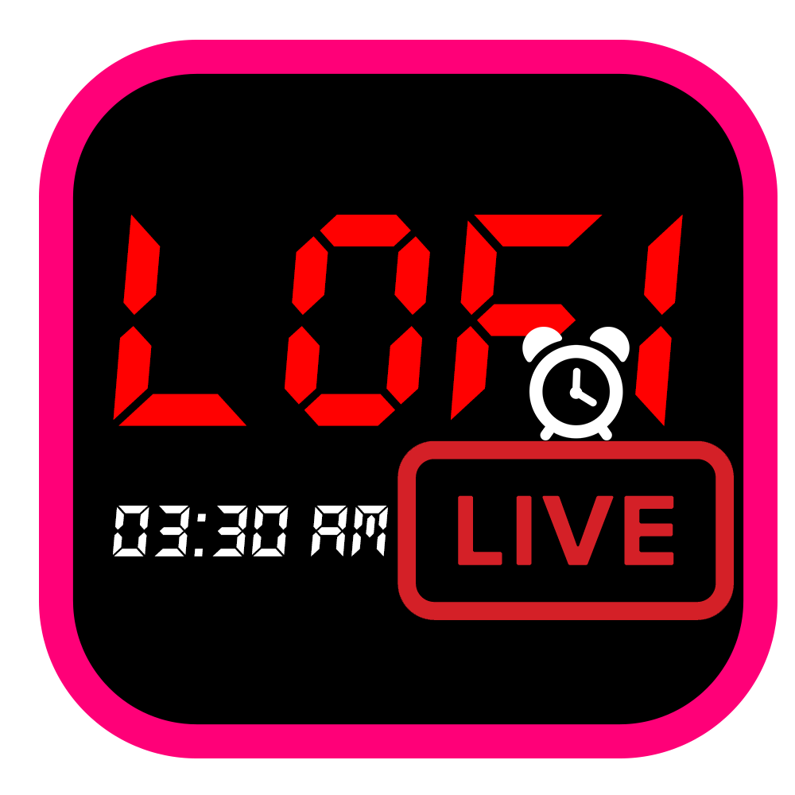
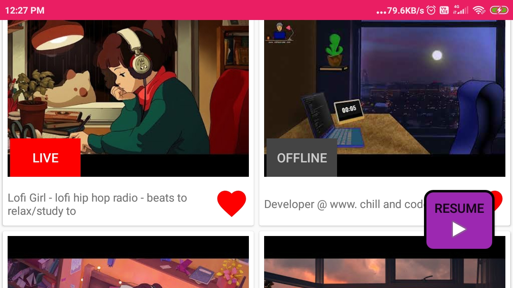
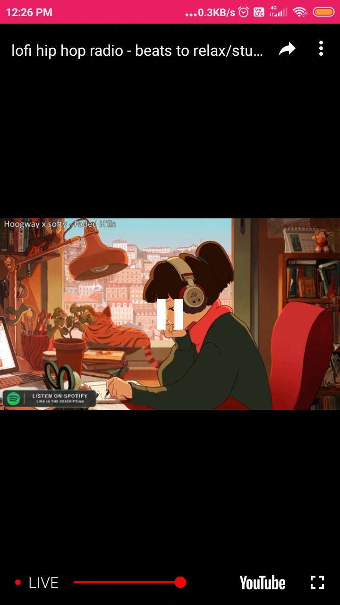
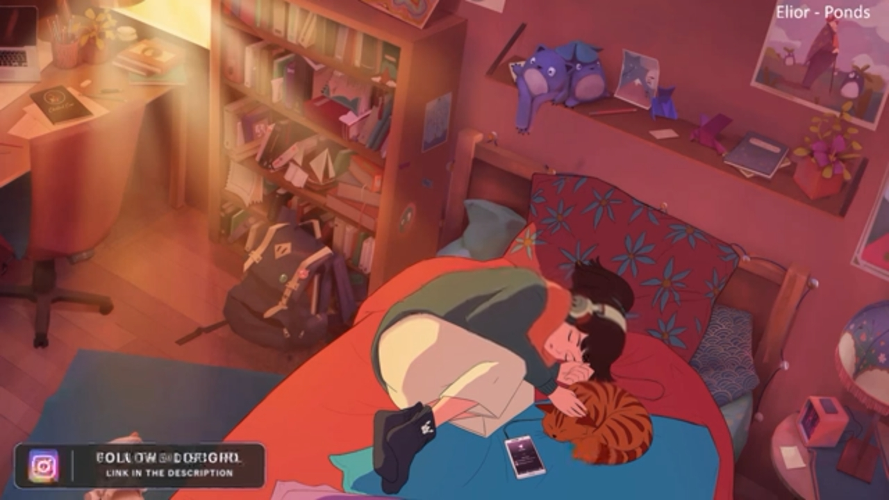
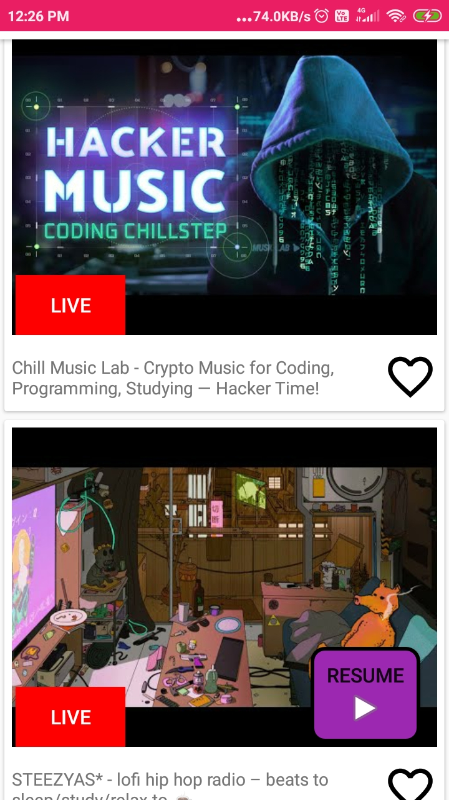
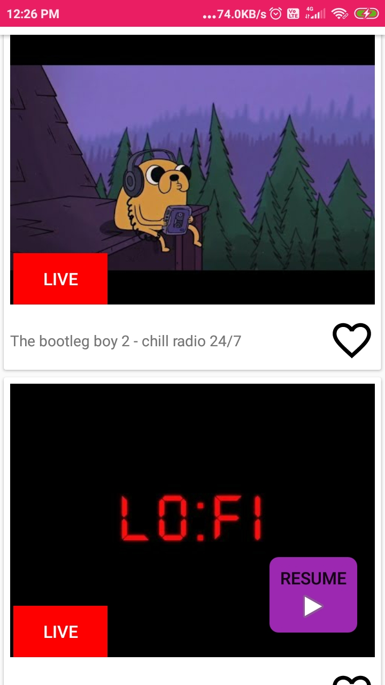

# Lofi-Live 
A simple app hosted setup using youtube api...  Play store link  https://play.google.com/store/apps/details?id=com.chillandcode.lofitube
 
youtube ad https://www.youtube.com/watch?v=A_VVl36zQRk
 

 
Screenshots :
<tr>
<td>
  
  </td>
  <td>

    </td>
  </tr>

